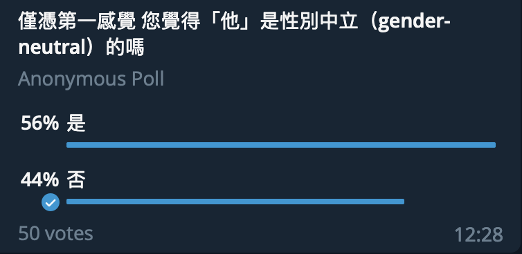

# Σύγκριση Για τα Γένη Μεταξύ της Κινεζικής Γλώσσας και της Ελληνικής Γλώσσας και Ζήτημα Φύλου στην Κινεζική Γλώσσα

Είναι το ίδιο κείμενο με την αγγλική εκδοχή, και δεν θέλω να μεταφράσω το μέρος «πριν αρχή».

---

Η κινεζική γλώσσα είναι μια γλώσσα χωρίς γένος. Η ελληνική γλώσσα είναι μια γλώσσα με τρία γραμματικά γένη. Η σύγκριση για τις δύο γλώσσες μπορεί να μας δώσει μια καλύτερη κατανόηση για τα γραμματικά γένη και το ίδιο το φύλο σε μια γλώσσα, οδηγώντας μας στο ζήτημα του φύλου, ένα υπάρχον πρόβλημα στην Κίνα και πώς υπάρχει στα Μανδαρινικά.

## Το Γραμματικό Γένος και το Φυσικό Γένος

Είναι προφανές ότι το «γραμματικό γένος», που είναι μια ταξινόμηση για ουσιαστικά, δεν είναι το ίδιο με το «φυσικό γένος». Είναι επίσης προφανές ότι τα ελληνικά έχει καταλήξεις για να δείχνει γραμματικά γένη, που δεν έχει το Μανδαρίνο. Επομένως, όταν μιλάμε για το γένος στα ελληνικά, αναφέρεται πάντα σε γραμματικά γένη, αλλά για τα κινέζικα, αναφέρεται πάντα σε φυσικά γένη.

## Δομή

### Αντωνυμίες

Ο πιο συνηθισμένος τρόπος για καθορισμό του γένους είναι η χρήση των αντωνυμιών.

**Αντωνυμίες στα Ελληνικά (ονομαστική, ενικός)**

| 1 |	2	| 3 (αρσενικό) | 	3 (θηλυκό) | 3 (ουδέτερο) |
| :--: | :--: | :--: | :--: | :--: |
| εγώ	| εσύ |	αυτός	| αυτή	| αυτό |

**Αντωνυμίες στα Τυποποιημένα Κινέζικα [1](https://kunihi.ro/2023/01/24/Sygkriki-gia-ta-geni-metaksy-kinezika-ellinika-kai-zitima-phyloy-sta-kimezika.html#παραπομπές)**

| 1	| 2	| 3 (για άντρες) |	3 (για γυναίκες) | 3 (για άλλα) |
| :--: | :--: | :--: | :--: | :--: |
| 我	| 你	| 他	| 她	| 它 |

Και τα κινέζικα και τα ελληνικά έχουν διαφορετικά γένη στις αντωνυμίες, ωστόσο, «他», «她» και «它» ακούγονται ίδια (Πινγίν: tā). Ο χαρακτήρας «她» χρονολογείται από το 1920. Για να μεταφράσει την αγγλική λέξη «she», ο Liu Bannong εισήγαγε και συζήτησε τον χαρακτήρας, που δέχτηκε από την κοινωνία αργότερα.

Αφού το φαινόμενο είναι νέο, τότε πώς είναι για τις διαλέκτους; Για παράδειγμα, καντονέζικα:

**Αντωνυμίες στα Καντονέζικα**

| 1	| 2	| 3 |
| :--: | :--: | :--: |
| 我 |	你	| 佢 (LSKH Jyutping: koei5) |

Στην πραγματικότητα, ο χαρακτήρας «姖 (LSKH Jyutping: geoi5)» υπάρχει και μερικά άτομα θέλουν να τον χρησιμοποιήσουν σαν μια καντονέζικη εκδοχή του «她». Ωστόσο, δεν γίνεται ποτέ αποδεκτό. Οι περισσότερες κινεζικές διάλεκτοι έχουν μόνο ένα τρίτο προσωπική αντωνυμία, όπως «伊 (Πινγίν του Qian: hhi)» στα κινέζικα Γου. Δεν ξεχωρίζουν, ούτε στο γραπτό ούτε στο προφορικό.
Ωστόσο, υπάρχει ένα χαρακτηριστικό και στα κινέζικα και στα ελληνικά, Οι δύο γλώσσες μπορούν να παραλείψουν την αντωνυμία. Για παράδειγμα:

### Ουσιαστικά

Για τα ουσιαστικά στα ελληνικά, τις περισσότερες φορές το φυσικό γένος είναι το ίδιο με το γραμματικό γένος, που μπορεί να ξεχωρίσει από τις καταλήξεις. Αν μια λέξη τελειώνει με «ς», μάλλον είναι αρσενική· αν με «α, η», θα πρέπει να είναι θηλυκό· αν με «μα, ο, ι», είναι ουδέτερο.

Για τα Μανδαρινικά, δεν είναι δύσκολο να δώσει ένα γένος. Τα άτομα απλά βάζουν «男 (Πινγίν: nán)» για τους άντρες και «女 (Πινγίν: nǚ, IPA: /ny²¹⁴/)’» για τις γυναίκες. Για παράδειγμα, «男教師 (Πινγίν: nán jiào shī)» σημαίνει «δάσκαλος» και «女教師 (Πινγίν: nǚ jiào shī)» σημαίνει «δασκάλα». Αν είναι ζώα, γίνεται σε «公 (Πινγίν: gōng)» και «母 (Πινγίν: mǔ)». Για παράδειγμα, «公貓 (Πινγίν: gōng māo)» είναι «γάτος» και «母貓 (Πινγίν: mǔ māo)» είναι «γάτα». Γραμματικά, κανείς δεν γνωρίζει το φύλο αν δεν προσδιορίζεται.

### Χαρακτήρες

Ένας μόνο χαρακτήρας είναι πραγματικά μπορεί να δείξει το φύλο. Ένας χαρακτήρας συνήθως έχει δύο μέρη, ένα ενδεικνύει την σημασιολογική κατηγορία και το άλλο δείξει τη φωνή. Για παράδειγμα, το φωνητικό μέρος των χαρακτήρων «他» και «她» είναι το ίδιο. Το σημασιολογικό μέρος ‘亻’ σημαίνει «άτομο», όχι μόνο άντρας, αλλά το σημασιολογικό μέρος ‘女’ μόνο σημαίνει γυναίκα. Είναι ο λόγος που «她» μπορεί να σημαίνει «αυτή» και το «他» είναι αρχικά μια γενική αντωνυμία.

Σημαίνει ότι στα κινεζικά, αν και δεν υπάρχει γραμματικό γένος, μπορεί να έχει την έννοια της υποβάθμισης των γυναικών, καθώς πολλοί χαρακτήρες με το σημασιολογικό μέρος «女» είναι συνήθως υποτιμητικά. Υπάρχουν μερικά παραδείγματα:

妒: (μια γυναίκα) ζηλεύει μια άλλη γυναίκα  
奴: δούλος  
姦: (ουσιαστικό)κακό; (βήμα)βιάζω

Ωστόσο, δεν σημαίνει ότι οι χαρακτήρες με αυτό το σημασιολογικό μέρος έχουν πάντα υποτιμητικό σημασία, όπως ο χαρακτήρας «她», ή δείχνουν γυναικείες φιγούρες, όπως ο χαρακτήρας «如», που συνήθως σημαίνει «σαν», δεν έχει ακόμα και γυναικεία έννοια.

## Ζήτημα Φύλου

Στην πραγματικότητα, η κινεζική γλώσσα και η ελληνική γλώσσα μοιράζονται μερικά από τα ίδια χαρακτηριστικά, όπως το «αρσενικό ως κανόνας» στην κοινωνία. Τις περισσότερες φορές, δεν είναι μέρος της γραμματικής αλλά μέρος της ομιλίας.

### Αντωνυμίες

Ο Χαρακτήρας ‘她’ ήταν ένα σημαντικό μέρος στο Κίνημα του Νέου Πολιτισμού, γιατί βοήθησε την απελευθέρωση των γυναικών και το κίνημα του φεμινισμού εκείνη την εποχή. Με την ίδια προφορά, αυτός ο χαρακτήρας έγινε γενικός, νικώντας τη λέξη «他女 (Πινγίν: tā nǚ)», η οποία δανείστηκε από την ιαπωνική λέξη kanojo (彼女, 彼 (kano, αυτού) + 女 (onna, γυναίκα)) και τη λέξη «伊 (Πινγίν: yī), που ήταν η πρώτη λέξη για την λέξη «αυτή».

Ωστόσο, η αλήθεια δεν είναι πάντα όπως η θεωρία. Για να γνωρίζουμε την πραγματικότητα, μια δημοσκόπηση ορίστηκε για διερεύνηση αν η αντωνυμία «他» θεωρείται ακόμα χωρίς φύλο ή όχι.

  
(Το αποτέλεσμα μιας όχι πολύ ακριβούς δημοσκόπησης)

Υπάρχουν τυχαία 50 ψηφοφόροι, και 44% (22 άτομα, συμπεριλαμβανομένου εμένα), σχεδόν τα μισά, νομίζουν ότι δεν είναι ουδέτερο ως προς το φύλο. Σημαίνει ότι η αντωνυμία «她», που επηρεάστηκε από τα αγγλικά, πήρε τη γυναικεία σημασία από την αντωνυμία «他», η οποία έγινε η αντωνυμία των ανδρών στην ομιλία, χάνοντας την ουδετερότητά του αλλά εξακολουθεί να είναι γενική στη γράμμα, συν το τρέχον ζήτημα προτίμησης γιου στην Κίνα, προσκαλώντας το πρόβλημα «άντρα ως κανόνα» στις αντωνυμίες της κινεζικής γλώσσας.

Ευτυχώς, περισσότεροι άνθρωποι αντιλαμβάνονται το πρόβλημα και η έκφραση «TA» έχει δημιουργηθεί για ουδέτερη χρήση. Αυτή η έκφραση είναι από τον ήχο, γιατί όλες οι τρίτες προσωπικές αντωνυμίες ακούγονται το ίδιο. Η έκφραση γίνεται δημοφιλής στο Διαδίκτυο.

### Λέξεις

Στη σημασιολογία, η λέξη «ασημάδευτος» αναφέρεται συνήθως σε μια βασική λέξη, συνήθως σε αυτήν χωρίς επίθεμα ή σε αυτήν που μπορεί να αναφέρεται σε μια ολόκληρη ομάδα. Μια παράδειγμα είναι η πρόταση «How old are you? (Πόσο χρονών είσαι;)», την οπόια όλοι χρησιμοποιούν. Όταν κάποιος ρωτάει, δεν υποδηλώνει ότι «είσαι» μεγάλος ή νέος. Ωστόσο, όταν κάποιος ρωτάει «How young is Henry? (Πόσο νέος είναι ο Χένρι;)», σίγουρα αυτός υπονοεί ότι ο Χένρι είναι νέος. Στα αντώνυμα «old (μεγάλος)» και «young (νέος)», το «old» είναι ασημάδευτο, καθώς μπορεί να χρησιμοποιηθεί και στις δύο σημασίες, δηλαδή είναι «ουδέτερο».

Κατά τη διάρκεια του 2020, το ζήτημα «πρόεδρος ή προεδρίνα» έλαβε μεγάλη προσοχή στην Ελλάδα, που δείχνει ότι στα ελληνικά ο αρσενικός τύπος είναι ασημάδευτος. Η κατάσταση είναι η ίδια στα κινέζικα: στα κινέζικα, αν δεν δίνεται φύλο σε μια λέξη (ειδικά επαγγέλματα, τίτλοι κ.λπ.), τις περισσότερες φορές η λέξη αναφέρεται στον άντρα. Δηλαδή, η ασημάδευτη μορφή δεν είναι τόσο ουδέτερη ως προς το φύλο όσο αυτό που σκέφτονται τα άτομα στα κινέζικα. Θεωρητικά, μια λέξη στα κινέζικα πρέπει να είναι ουδέτερη ως προς το φύλο. Ωστόσο, λόγω της επιρροής του «άντρα ως κανόνα», στην πραγματικότητα, μια ασημάδευτη λέξη, φυσικά που μπορεί να βάλει με «男» ή «女», συνήθως αναφέρεται σε άντρα.

Το 2014, μια Ταϊβανέζη πολιτικός, η Lai Pin-yu (賴品妤), η οποίοα συμμετείχε στο φοιτητικό κίνημα Sunflower, στο Διαδίκτυο γίνεται «太陽花女戰神», που κυριολεκτικά σημαίνει «θεά του πολέμου στο κίνημα Sunflower».

Η λέξη «女戰神 (Πινγίν: nǚ zhàn shén)» κυριολεκτικά μεταφράζεται σε «θεά». Ωστόσο, όπως το κείμενο παραπάνω, η μορφή δεν είναι η ίδια στα κινέζικα. Αυτή η σύνθετη λέξη αποτελείται από «女» και «戰神». Χρησιμοποιώντας τις ασημάδευτες μορφές, είναι «γυναίκα» και «θεός του πολέμου».

Η απάντησή της έδειξε την ίδια άποψη: «Γιατί η λέξη “γυναίκα” βάλθηκε; Αποκαλείτε τον Huang Kuo-chang (黃國昌) «θεός του πολέμου», αποκαλείτε τον Lin Fei-fan (林飛帆) «θεός του πολέμου». Γιατί με αποκαλεί “γυναίκα θέος του πολέμου”; Νομίζω ότι αυτό συμβαίνει επειδή οι γυναίκες υποτίθεται ότι είναι πιο αδύναμες, οπότε όταν νιώθουν ότι είστε διαφορετικοί, θα δείξουν συγκεκριμένα ότι είστε γυναίκα. [2](https://kunihi.ro/2023/01/24/Sygkriki-gia-ta-geni-metaksy-kinezika-ellinika-kai-zitima-phyloy-sta-kimezika.html#παραπομπές)»

### Κακές λέξεις

Για τα ζητήματα φύλου, αυτές οι κακές λέξεις είναι αναπόφευκτες. Δεν υπάρχει παράδειγμα εδώ γιατί οι χαρακτήρες μπορούν να δώσουν τα πάντα.
Στα ελληνικά, αυτές οι λέξεις περιλαμβάνουν αρσενικές και θηλυκές μορφές. Έχουν ακόμη και τις ουδέτερα λέξεις.

Ας υποθέσουμε ότι υπάρχει μια κατηγορία για τισ κακές λέξεις στα κινέζικα. Δυστυχώς, οι λέξεις με την έννοια της υποβάθμισης γυναίκας θα θεωρηθούν περισσότερο σαν κακή λέξη. Η λέξη μπορεί να δείχνει σε μια γυναίκα άμεσα ή να συμπεριλάβει τους χαρακτήρες που συνήθως έχουν το σημασιολογικό μέρος «女», όπως αυτό που συζητήσαμε παραπάνω, μέσα στη δομή των χαρακτήρων.

Όπως στο βιβλίο *Women, Fire, and Dangerous Things*, «τα όλα κοινωνικά στερεότυπα μπορούν να χρησιμοποιηθούν για να αντιπροσωπεύσουν μια κατηγορία». Προέρχεται από τα εσωτερικά μιας κουλτούρας: το ζήτημα της προτίμησης γιου, οι διακρίσεις των γυναικών, ακόμη και η αντικειμενοποίηση των γυναικών.

### Τα Μανδαρινικά είναι μια ουδέτερη ως προς το φύλο γλώσσα;

Η απάντηση μπορεί να είναι «ναι και όχι», καθώς εξαρτάται από το πώς χρησιμοποιούν τα άτομα αυτήν τη γλώσσα. «Όχι», είναι επειδή όλα τα προβλήματα πάνω. «Ναι», γιατί αρχικά θα έπρεπε να είναι μια γλώσσα ουδέτερη ως προς το φύλο και μπορούμε να δούμε ότι υπάρχουν πολλά άτομα να τη χρησιμοποιούν χωρίς φύλο. Για παράδειγμα, όταν ένα άτομο που μιλάει Μανδαρινικά θέλει να αναφέρει έναν/μια τυχαίο «αεροσυνοδό», καθώς η αεροσυνοδός είναι πάντα γυναικείο επάγγελμα στην Κίνα, θα λένε πάντα «空姐 (Πινγίν: kōng jiě)», τη συντομογραφία του «空中小姐 (κυρία στον αέρα)», με ο χαρακτήρας «小姐 (κυρία, Πινγίν: xiǎo jiě)» δίνει την έννοια μιας κυρίας. Μερικοί άνθρωποι προτιμούν μια πιο ουδέτερη και επίσημη λέξη, «空乘  (Πινγίν: kōng chéng)», τη συντομογραφία του «空中乘務員 (συνοδός στον αέρα)».

Δεν υπάρχει άλλος τρόπος να λυθεί το πρόβλημα από την αναθεώρηση του πολιτισμού και της κοινωνίας. Ευτυχώς, μπορούμε να παρατηρήσουμε την πρόοδο. Καθώς η γλώσσα αλλάζει συνεχώς, μπορούμε να προβλέψουμε ένα πιο φιλικό μέλλον με μια πιο φιλική γλώσσα.

## Παραπομπές

[1](https://kunihi.ro/2023/01/24/Sygkriki-gia-ta-geni-metaksy-kinezika-ellinika-kai-zitima-phyloy-sta-kimezika.html#αντωνυμίες) Τα Τυποποιημένα Κινέζικα είναι Μανδαρινικά στην Ηπειρωτική Κίνα. Η Ταϊβανέζικα Μανδαρινικά στην Ταΐβαν έχει μικρή διαφορά.
 
[2](https://kunihi.ro/2023/01/24/Sygkriki-gia-ta-geni-metaksy-kinezika-ellinika-kai-zitima-phyloy-sta-kimezika.html#λέξεις) 《[台灣女性參政遭遇挑戰：從性羞辱到婚育觀](https://www.bbc.com/zhongwen/trad/chinese-news-51006244)》, BBC 中文, 原文：「為什麼要加一個女字？你會叫黃國昌戰神，叫林飛帆戰神，為什麼叫我女戰神？我覺得背後就是預設女性應該是比較弱的，所以當他們覺得你不一樣的時候，還要特別標注一下你是女的。」

## Περαιτέρω ανάγνωση
George Lakoff, (1987) *Women, Fire, and Dangerous Things: What Categories Reveal About the Mind*, University of Chicago Press

刘半农, (1920) “她”字问题, 时事新报·学灯.

黄 兴涛, (2013) “她”字的故事——女性新代词符号的发明、论争与早期流播, Higashi ajia ni okeru gakugeishi no sōgōteki kenkyu no keizokuteki hatten no tameni, International Research Center for Japanese Studies, pp. 125-159.

David Moser, "*Covert Sexism in Mandarin Chinese*", Sino-Platonic Papers, 74 (January, 1997).
